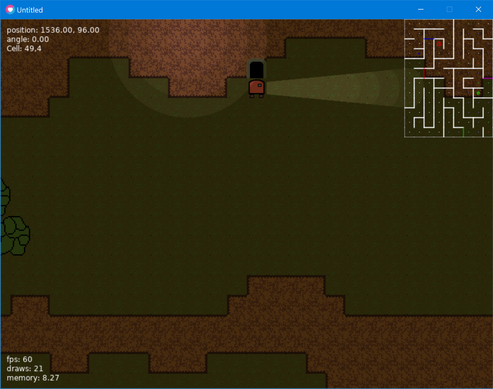
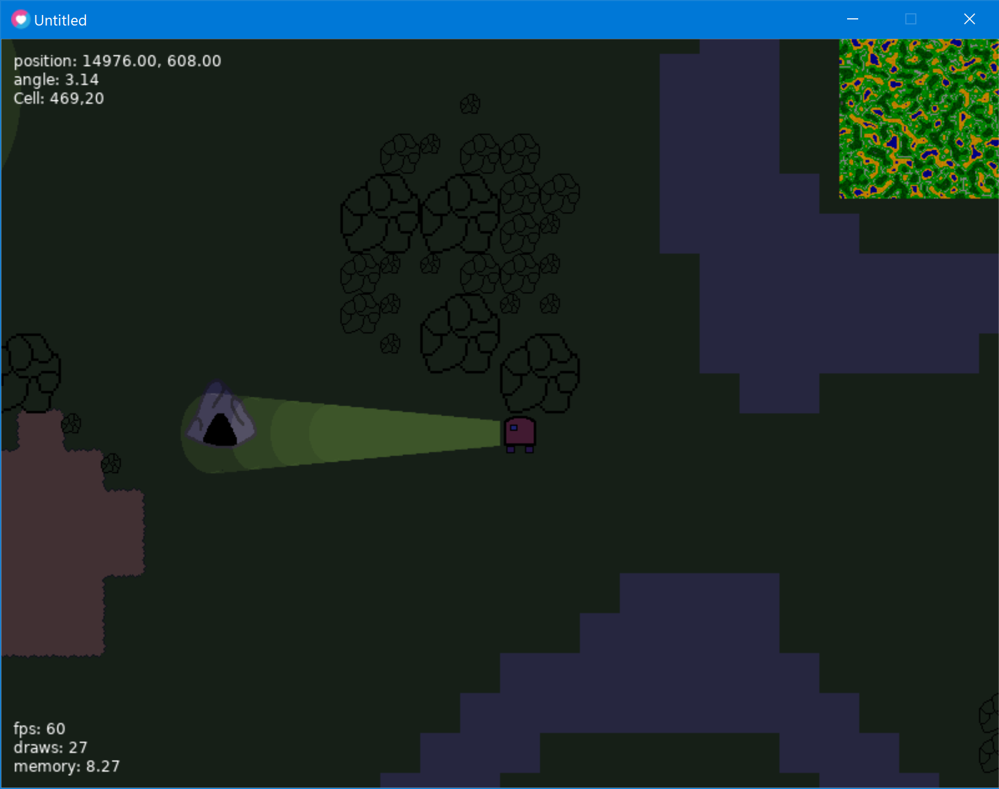

# Fantasy-Game-2

A more complete implementation of the fantasy game

Works with Love 11.3.

## what it has:
- Random overworld generation and object placement using Noise functions
- Random dungeon generation with multiple doors and keys (lines are doors, circles are keys)
- Basic lighting
- Dungeon entrances/exits
- Overworld and dungeon minimaps

## controls:
- movement - wsad
- action - space

